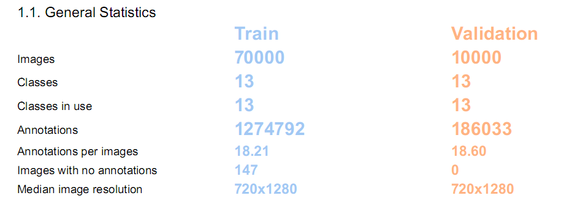
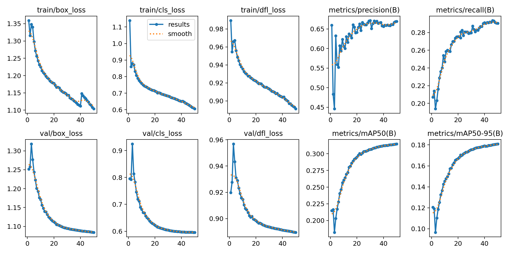
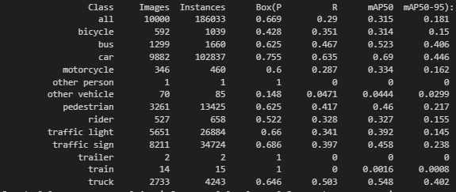
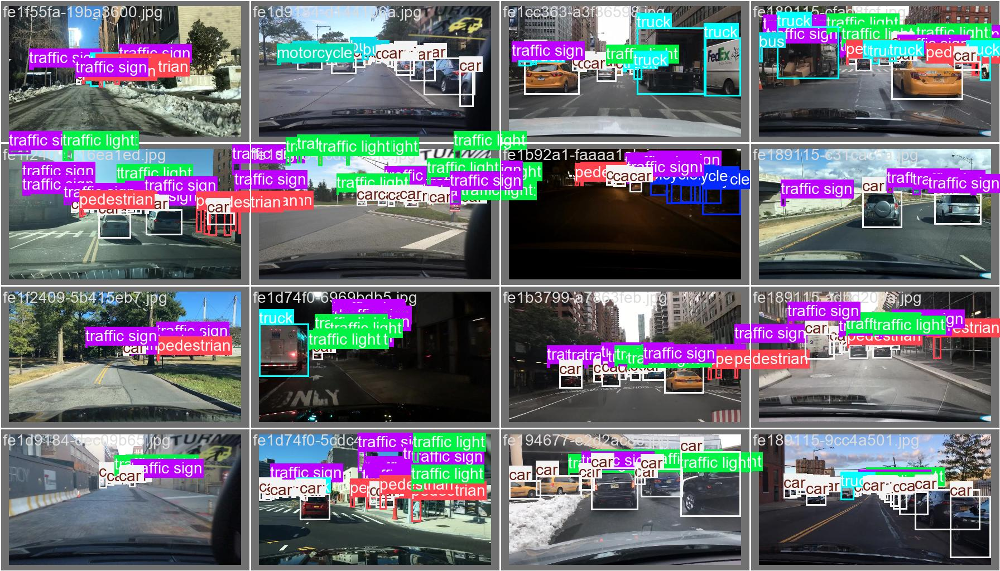
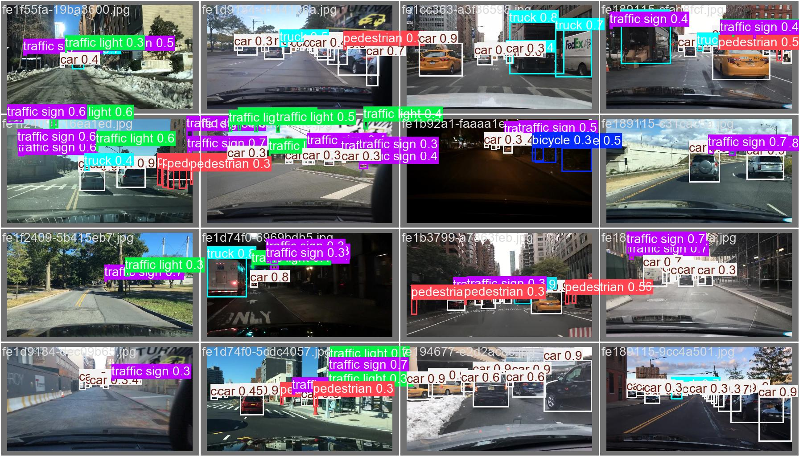

# BDD100K Object Detector

## Short Description
This project involves building an object detection model using the BDD100K dataset, which contains diverse driving scenarios captured under various weather conditions, times of day, and scenes. The objective is to detect and localize objects such as vehicles, pedestrians, and traffic signs from the dataset.

Go through [PROJECTSTRUCTURE.md](PROJECT_STRUCTURE.md) to know about code structure of project.

## Dataset Overview

The **BDD100K dataset** is one of the largest and most diverse driving datasets, consisting of:
- **100,000 images** captured from urban and highway driving scenes.
- **Annotations** for:
  - Bounding boxes for objects like `car`, `bus`, `pedestrian`, `traffic light`, etc.
  - Scene attributes such as:
    - **Weather:** Clear, rainy, snowy, etc.
    - **Time of day:** Daytime, nighttime, dawn/dusk.
    - **Occlusion and truncation** levels for detected objects.

Dataset download -   [BDD100K's website](https://dl.cv.ethz.ch/bdd100k/data/).
```commandline
cd scripts
chmod +x download_data.sh
# To work with docker - setup docker 
chmod +x setup_docker_env.sh
# To download the data
./download_data.sh
```

## Data statistics



## Installation:

```commandline
python -m venv .venv
source .venv/bin/activate
pip install requirements.txt
```

Setup .env file with necessary required arguments similar to .envsample file
## How to run:

### 1. Perform Data Analysis

Setup a data_config.yaml which contains
```commandline
# Path of downloaded BDD100K labels json
train_label: det_train.json
val_label: det_val.json

# Path of the downloaded BDD100K images
train_images: data/bdd100k/images/100k/train
val_images: data/bdd100k/images/100k/val

# Path to save the preprocessed data as csv file
train_csv: data/processed/bdd100k/train.csv
val_csv: data/processed/bdd100k/val.csv"
```
```commandline
cd notebooks
# Open [report.ipynb](notebooks/report.ipynb) from vscode
```
### 2. Train Model
Train the model using the preprocessed data.

```commandline
cd notebooks
# Open [train.ipynb] from vscode to train the model
```

Alternatively train can be invoked from python script

```commandline
cd src
python main.py --yolo_config_path config/bdd100k.yaml --num_epochs 50 --batch -1 --project bdd_100k_detect --data_config_path config/data_config.yaml --cmd --train
```

or

```commandline
cd scripts
chmod +x train.sh
./train.sh
```
### 3. Evaluate Model
Evaluate the performance of the trained model.

```commandline
cd notebooks
# Open [predict.ipynb] from vscode to evaluate the model
```

## Model Details

| Model       | Layers | Parameters     |
|-------------|--------|----------------|
| YOLOv11s    | 238    | 9,417,831      |

## Results

### Metrics plot


| Metric         | Value  |
|----------------|--------|
| metrics/precision | 0.669  |
| metrics/recall | 0.290  |
| metrics/mAP50  | 0.315  |

### Class wise metrics



### Samples

<table>
  <tr>
    <td></td>
    <td></td>
  </tr>
</table>
Left is ground truth and right side image is prediction


--------

